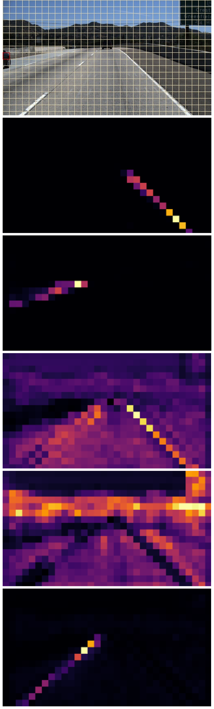

<h1 align="center">LANE DETECTION ALGORITHM FOR AUTONOMOUS VEHICLE USING MACHINE LEARNING</h1>
This project explores the use of transformer architecture as feature extraction backbone in 4-lane detection model.

## Result
### TuSimple<sup>[[1]](#footnote1)</sup><sup>[[2]](#footnote2)</sup><sup>[[3]](#footnote3)</sup>
| Model | Input Resolution | Accuracy (%) | FP | FN | FLOPS | Params (M) | FPS |
| :---: | :---: | :---: | :---: | :---: | :---: | :---: | :---: |
|SegFormer (mit-b0) | (288, 512) | 95.52 | 0.0349 | 0.0451 | 3.86 | 18.22 | 86.58 |
|SCNN (VGG-16)      | (360, 640) | 95.17 | 0.0637 | 0.0622 | 218.64 | 20.96 | 21.18 |
<br>

### CULane<sup>[[1]](#footnote1)</sup><sup>[[2]](#footnote2)</sup><sup>[[3]](#footnote3)</sup>
| Conditions | F1-measure of SegFormer (mit-b0) (%) | F1-measure of SCNN (VGG-16) (%)|
| :---: | :---: | :---: |
| Normal | 89.04 | 90.6 |
| Crowded | 67.64  | 69.7 |
| Dazzle light  | 61.65  | 58.5 |
| Shadow | 66.01  | 66.9 |
| No line | 40.67 | 43.4 |
| Arrow | 80.98  | 84.1 |
| Curve | 62.43 | 64.4 |
| Crossroad | 2439(FP)  | 1990 (FP) |
| Night | 63.72 | 66.1 |

| Model | Input Resolution | FLOPS | Params (M) | FPS |
| :---: | :---: | :---: | :---: | :---: |
|SegFormer (mit-b0) | (288, 800) | 6.03   | 26.52  | 54.26 |
|SegFormer (mit-b0) | (288, 800) | 218.62 | 20.74  | 21.40 |
<br>

## Data preparation
### TuSimple
1. Download the data from [TuSimple github](https://github.com/TuSimple/tusimple-benchmark/issues/3)
2. Store the data according to the tree below.
```
├── TuSimple
│   ├── train
│   │   ├── clips
|   |   ├── label_data_0313.json
|   |   ├── label_data_0313_new.json
|   |   ├── label_data_0531.json
|   |   ├── label_data_0531_new.json
|   |   ├── label_data_0601.json
|   |   ├── label_data_0601_new.json
|   |   ├── test_label.json
└────────── test_label_new.json
```

### CULane
1. Download the data from [CULane website](https://xingangpan.github.io/projects/CULane.html)
2. Store the data according to the tree below.
```
├── CULane
│   ├── driver_23_30frame
│   ├── driver_37_30frame
│   ├── driver_100_30frame
│   ├── driver_161_30frame
│   ├── driver_182_30frame
│   ├── driver_193_30frame
└────── list
```

### Model training
```
train.sh
```
Ground truth for segmentation map will be generated if the path ./TuSimple/train/seg_label is not found.
<br>

### Model testing
#### TuSimple
```
python test_tusimple.py --exp_dir YOUR_EXP_DIR
```
#### CULane
1. build the cpp file
```
cd ./utils/lane_evaluation/CULane
mkdir build && cd build
cmake ..
make
```
```
python test_CULane.py -- exp_dir YOUR_EXP_DIR --resize_shape 800 288
```

## Inference
1. To export model to TRT engine (Torch -> ONNX -> TRT),
```
./export_trt.sh
```
2. Change the flags --toonnx & --totrt accordingly (due to GPU memory constraint, these conversions are seperated.)

| Dataset | FPS (PyTorch) | FPS (TensorRT) | Difference |
| :---: | :---: | :---: | :---: |
| TuSimple | 86.58 | 106.08 | Increase by 22% |
| CULane   | 54.26 | 69.07  | Increase by 27% |

## Result Visualisation
<div align="center">
  
</div>

<p align="center">
 Lane detection on crowded roads (CULane)
</p>
<br>

<div align="center">
  
</div>

<p align="center">
 Lane detection on roads with patches (TuSimple)
</p>
<br>

<div align="center">
  
</div>

<p align="center">
 Attention Map from first transformer block with lane mark as query
</p>
<br>

<div align="center">
  
</div>

<p align="center">
 Attention Map from third transformer block with car as query
</p>
<br>  


Reference
1. [SCNN (Pytorch)](https://github.com/harryhan618/SCNN_Pytorch)
2. [SCNN (Lua)](https://github.com/XingangPan/SCNN)
2. [Pytorch Autodrive](https://github.com/voldemortX/pytorch-auto-drive)

<a name="footnote1">[1]</a>: Performance of SCNN was obtained from https://github.com/voldemortX/pytorch-auto-drive/blob/master/docs/MODEL_ZOO.md

<a name="footnote2">[2]</a>: Flops and params of SegFormer are calculated based on thop (https://github.com/Lyken17/pytorch-OpCounter)

<a name="footnote3">[3]</a>: All the models are benchmarked on NVIDIA GeForce RTX 2080 Ti